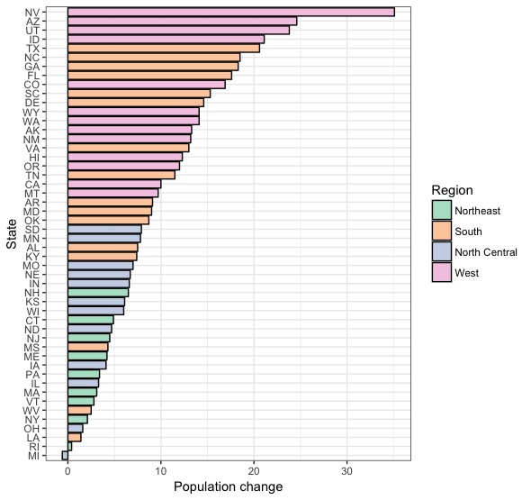
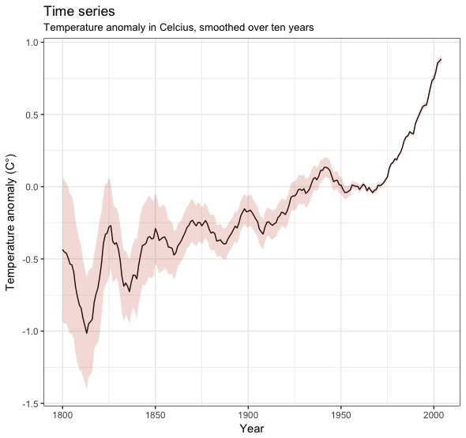

```{r, echo = FALSE, warning=FALSE,message=FALSE}
require(ggplot2)
require(gcookbook)
```

_Remember_: the cleaner and the more documented your code is, the more points you get.

To complete this homework, you will need to install the `gcookbook` package. **All the plot should be made with `ggplot2`**.

```{r, echo = TRUE}
# white background instead of the default grey. can remove it or change the theme
theme_set(theme_bw())
```

## Exercice 1: bar chart & color palette

**Question**: reproduce this plot, based on the `uspopchange` dataframe.



To do that, you may want to have a look at 

1. [this list](http://www.cookbook-r.com/Graphs/Colors_(ggplot2)/figure/unnamed-chunk-14-1.png) of color palette, that you can use in combination to `scale_fill_brewer()`
1. the `labs()` function 
    
Do not forget to _re-order_ the data so that the plot features this nice monotonic shape

```{r, echo = TRUE}
# ANSWER HERE
```

## Exercice 2: overlapping data points 

Have a look at this graph, which plots `hwy` against `cty`, and compare it to the dimension of the `mpg` dataframe.

```{r, echo = TRUE}
ggplot(mpg, aes(cty, hwy)) + geom_point() 
dim(mpg)
```

The original data has 234 data points, but the chart seems to display fewer points. Why? There are overlapping points appearing as a single dot, since both `cty` and `hwy` are integers.

**Question**: find two ways to show the actual number of data points in the plot.

_Hint_: 

1. the solutions are already coded in two different geoms, you just have to find which ones
1. to solve the problem, you may want to add noise ($\approx$ jitter the data points) and / or to count the number of overlapping data points

```{r, echo = TRUE}
# ANSWER HERE
```

## Exercice 3: histograms & density plots 

We would like to see the distribution of city mileage (`cyl` in the `mpg` dataframe), distinguishing the vehicles' cylinders.

First, do that with a plain histogram.

```{r, echo = TRUE}
# ANSWER HERE
```

But the result is quite disappointing. In particular, we cannot see how these histograms overlap.

To solve this problem, we are going to use kernel density estimate (you are going to learn about that in Econometrics III), which are nothing but smoothed versions of histograms. Plot the distribution of city mileage by vehicles' cylinders using these density plots.

```{r, echo = TRUE}
# ANSWER HERE
```

## Exercice 4: time series

**Question**: reproduce this plot, based on the `climate` data, collected by Berkeley. The shaded area represents the uncertainty for 10-year-smoothed anomaly.



_Hint_:

1. you can obtain info on this dataset [here](https://cran.r-project.org/web/packages/gcookbook/gcookbook.pdf)
1. start by subsetting the data set to focus only the data collected by Berkeley 
1. both the time series and the shaded area are already encoded in geoms 
1. the time series is a _line_
1. the shaded area is a _ribbon_

```{r, echo = TRUE}
# ANSWER HERE
```


