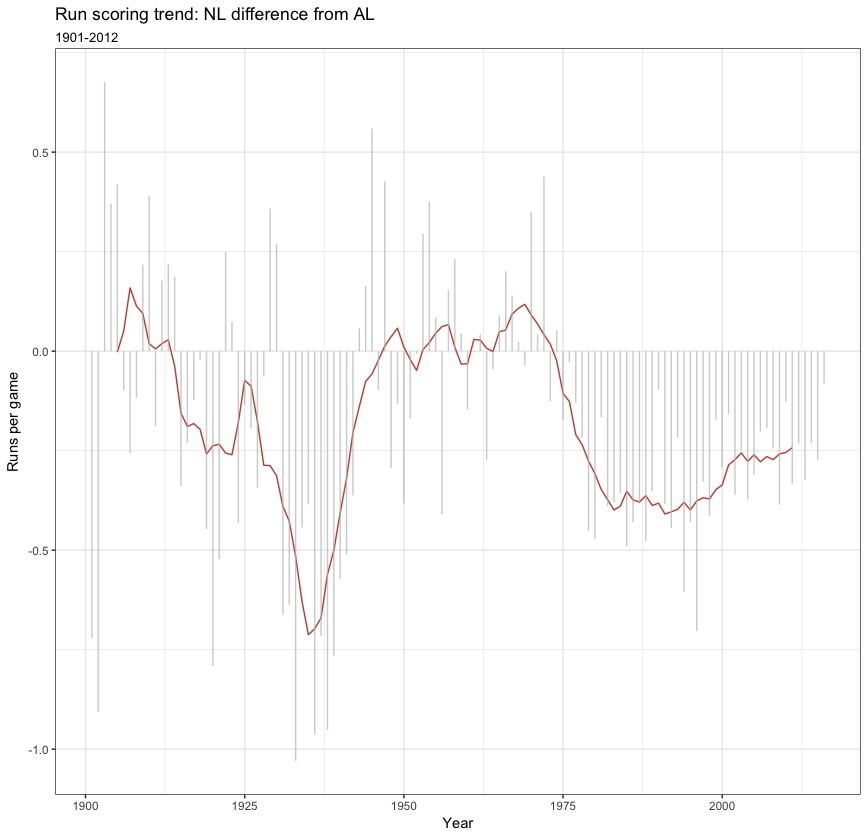

```{r, echo = FALSE, warning=FALSE,message=FALSE}
require(tidyverse)
require(Lahman)
require(zoo)
theme_set(theme_bw())
```

_Remember_: the cleaner and the more documented your code is, the more points you get.

**All the plot should be made with `ggplot2`, all the data transformation with `dyplr`**.

# Exercice: American vs. National League

In this exerice, we will try to see whether the American league is better than the National league in baseball. At the end of the exercice, you should produce this plot. 

{
width=70% }

The data that we are going to use is contained in the `Lahman` package, and is called `Teams` (see below). This dataset contains information on each baseball team from 1871 to 2012. In particular, it contains:

- the number of game played by each team, `G`
- the number of runs scored by each team, `R` (run = point-ish)
- the year, `yearID`
- the league, `lgID`
- the team, `teamID`
    
**Q1**: the American league was created in 1901. Subset the dataset so that it contains only observations when both leagues are present. 

```{r, echo = T}
# loading the data for you
team <- as.tibble(Lahman::Teams)

# YOUR ANSWER GOES HERE

teamal=filter(team, yearID>=1901)

```

**Q2**: compute the average runs per game for each team, each year

```{r, echo = TRUE}
# YOUR ANSWER GOES HERE

r=group_by(teamal, teamID, yearID)
summarise(r, meanrun=mean(R,na.rm = T))

```

**Q3**: create a new data frame that contains observations at the league level. In particular, we want the number of games and the number of runs, per league (`AL` or `NL`) and per year. Once this is done, compute the average runs per game (again, for each league, each year) 

```{r}
# YOUR ANSWER GOES HERE

r2=group_by(teamal, lgID, yearID)
newteam <- mutate(r2, Gperleague=sum(G,na.rm = T)
                  ,Rperleague=sum(R,na.rm = T),
                  aveRpergame=Rperleague/Gperleague)


newteam <- select(newteam, lgID, yearID, Gperleague,Rperleague,aveRpergame )

newteam <- unique(newteam)

newteam <- filter(newteam, lgID=="AL"|lgID=="NL")

league <- teamal %>%
           # in case there are some wrong-coded observations
           filter(lgID %in% c("AL","NL")) %>%
           # group by year and by league 
           group_by(yearID, lgID) %>% 
           # compute the numbers of runs and the number of games played in               each league, each year
           summarize(R = sum(R, na.rm = T), G = sum(G, na.rm = T)) %>%
           # compute the average
           mutate(LG_RPG = R / G)
```

**Q5**: plot the time series of average runs per game, for each league.

```{r}
# YOUR ANSWER GOES HERE

ggplot(newteam,aes(x=yearID,y=aveRpergame,color=lgID))+geom_line()

```

As you can see, the time series are noisy. To get a better picture, we are going to compute the 10-year moving average. To do that, we will use the function `rollmean` from the `zoo` package (if you don't know how to use it, `?roomean` should help).

**Q6**: compute, for each league, the 10-year moving average of the runs per game variable. Once this is done, plot together the time series of the original average runs per game (same as before), and the the 10 year moving average of the runs per game.

```{r}
# YOUR ANSWER GOES HERE

league <- league %>%
          # group by league
          group_by(lgID) %>% 
          # then compute the 10 years moving average
          mutate(LG_RPG_m = rollmean(x = LG_RPG,                  k = 10, fill = NA))
ggplot(league)+geom_line(aes(x=yearID,y=LG_RPG,color=lgID),linetype="dotted")+geom_line(aes(x=yearID,y=LG_RPG_m,color=lgID))

```

**Q7**: create a new dataset that computes the difference between the average runs per game (both for the original data and the 10-year moving average) of the American league and the National league, for each year.

```{r}
# YOUR ANSWER GOES HERE

league_diff <- league %>%
               group_by(yearID) %>%
               summarize(runDiff = diff(LG_RPG), runDiff_m = diff(LG_RPG_m))

```

**Q8**: you now have all the data needed to reproduce the original plot. Specifically, plot the time series of the difference of the 10-year moving average, and superpose to it the actual difference (i.e. not the 10-year moving average).

```{r}
# YOUR ANSWER GOES HERE
ggplot(data = league_diff) + 
  geom_line(aes(x = yearID, y= runDiff_m), color = "tomato3") + 
  geom_segment(aes(x = yearID, xend = yearID, y=0, yend=runDiff), alpha = 0.7, color = "grey")
```